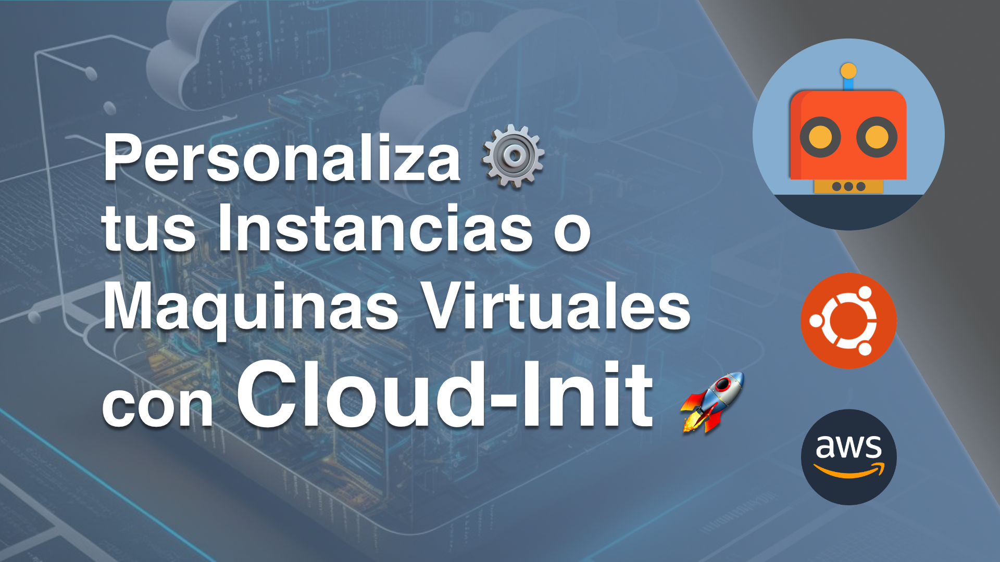

# Personaliza ⚙️ tus instancias o maquinas virtuales con Cloud-Init 🚀

Hoy os voy a mostrar como personalizar tus instancias o maquinas virtuales con Cloud-Init.

**Video:**

0:00 Inicio

0:06 Intro

0:18 Que es Cloud-Init?

0:41 Explicación

12:00 DEMO

16:56 Conclusión

17:19 Despedida

17:28 Outro

GitHub:
https://github.com/TheAutomationRules/cloud-init/blob/main/Video_01/README.md

Twitter: @TheAutomaRules
Instagram: TheAutomationRules

#cloud-init #aws #ec2 #terraform #instance #vm

---
## Requisitos:

- Tener instalado Terraform.
- Tener una cuenta de AWS.

---

## How2Use

- Clona este repositorio ej: **git clone https://github.com/TheAutomationRules/cloud-init.git**
- Entra al directorio del video ej: **cd Video_01/**
- Modifica las variables locales con los IDs de tu security_group, subnet_id y modifica la ssh_pub_key con la tuya.
- Exporta tu access y secret keys de AWS ej: **export AWS_ACCESS_KEY_ID=AWSACCESSKEY && export AWS_SECRET_ACCESS_KEY=SECRETKEY && export AWS_DEFAULT_REGION=eu-central-1**
- Inicializa Terraform ej: **terraform init**
- Ejecuta un **PLAN** de Terraform ej: **terraform plan**
- Ejecuta un **APPLY** de Terraform ej: **terraform apply --auto-approve**
- Accede a tu instancia de HashiCorp Consul usando la IP publica y añadiendo el puerto 8500 ej: **http://PUBLIC-IP:8500**
- Cuando hayas terminado de probar elimina la instancia ej: **terraform destroy --auto-approve**